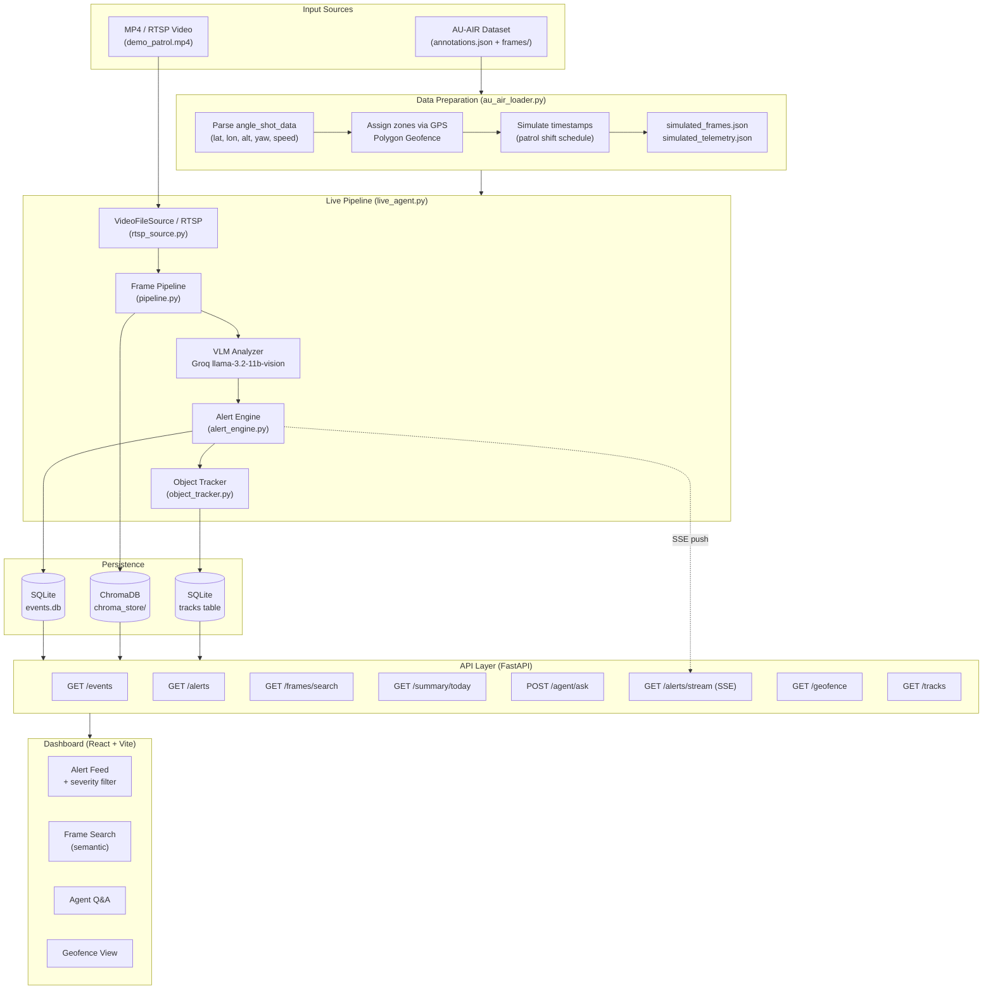
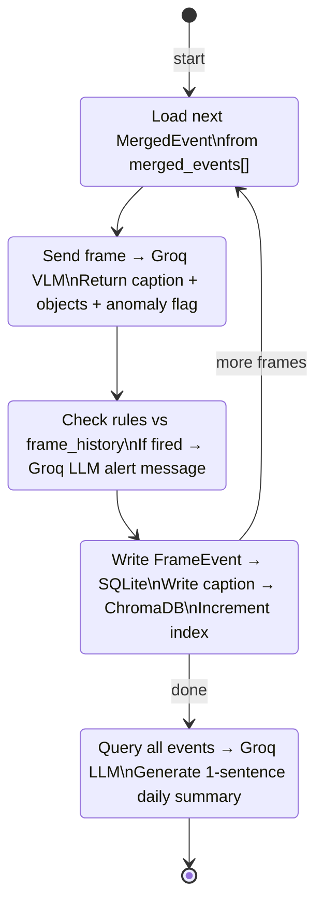
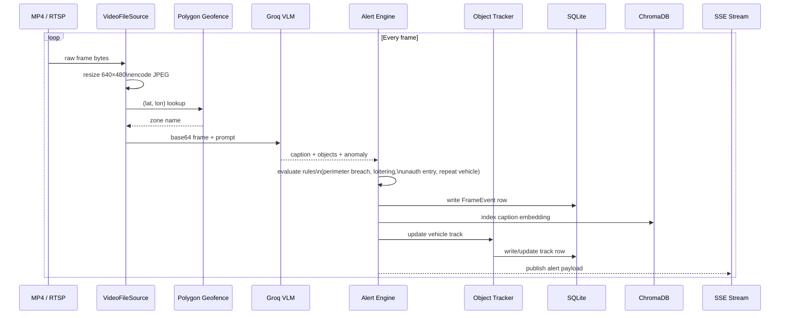
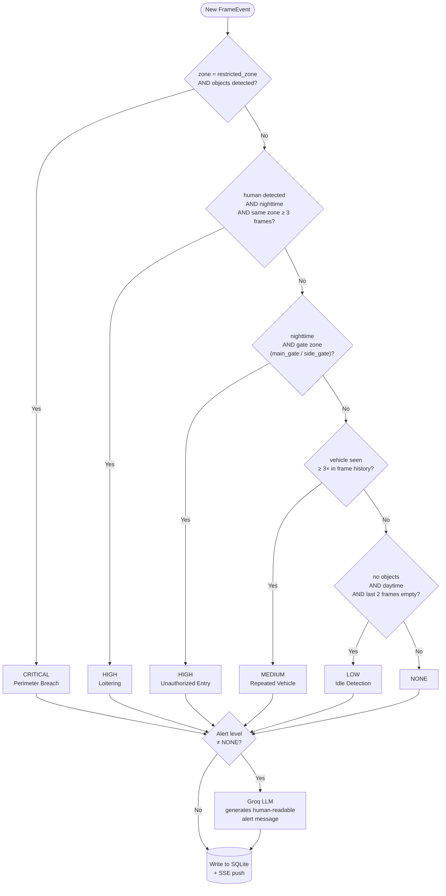
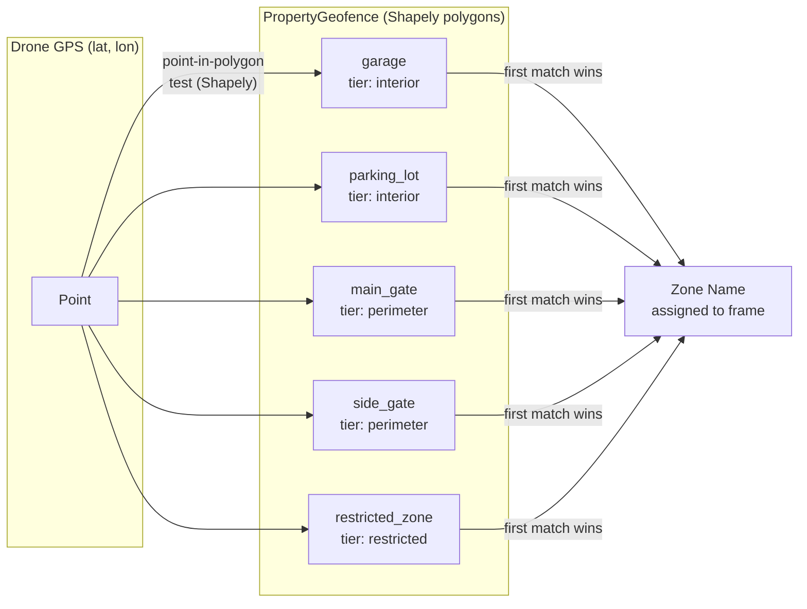
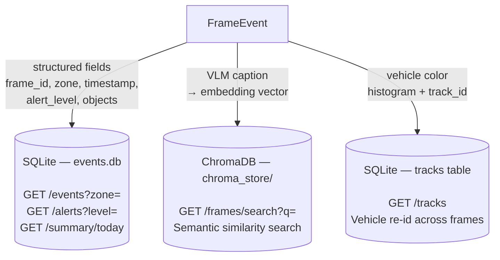
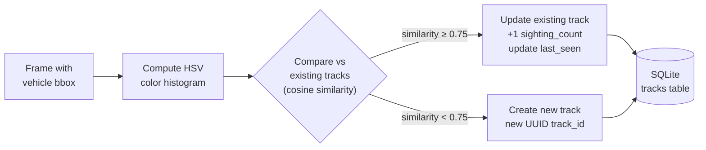
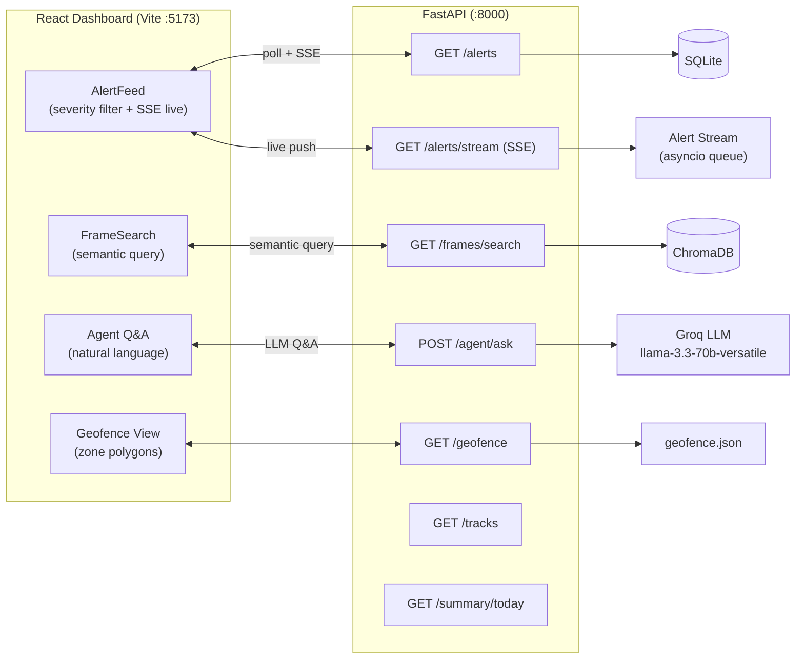

# System Architecture — Drone Security Analyst Agent

## 1. High-Level System Overview

---

## 2. LangGraph State Machine (Batch Agent)

---

## 3. Live Video Pipeline

---

## 4. Alert Rule Evaluation (Priority Order)

---

## 5. Polygon Geofence — Zone Assignment

---

## 6. Dual Storage Model

---

## 7. Object Tracking (Vehicle Re-ID)

---

## 8. API + Frontend Data Flow

---

## Tech Stack Summary

| Layer | Technology | Purpose |
|---|---|---|
| Dataset | AU-AIR | Real aerial frames + per-frame telemetry |
| Video Input | OpenCV / RTSP | Read MP4 or live RTSP stream |
| Vision AI | Groq `llama-3.2-11b-vision-preview` | Frame captioning + object detection |
| LLM | Groq `llama-3.3-70b-versatile` | Alert messages + natural language Q&A |
| Agent Framework | LangGraph | Stateful looping graph for batch processing |
| Geofencing | Shapely | GPS point-in-polygon zone assignment |
| Object Tracking | OpenCV HSV histograms | Vehicle re-identification across frames |
| Alert Streaming | FastAPI SSE | Real-time push to dashboard |
| Relational DB | SQLite | Structured event + track storage |
| Vector DB | ChromaDB | Semantic search over VLM captions |
| API | FastAPI | REST + SSE backend |
| Dashboard | React (Vite) | Alert feed, search, Q&A, geofence UI |
| Config | python-dotenv | Environment variable management |
