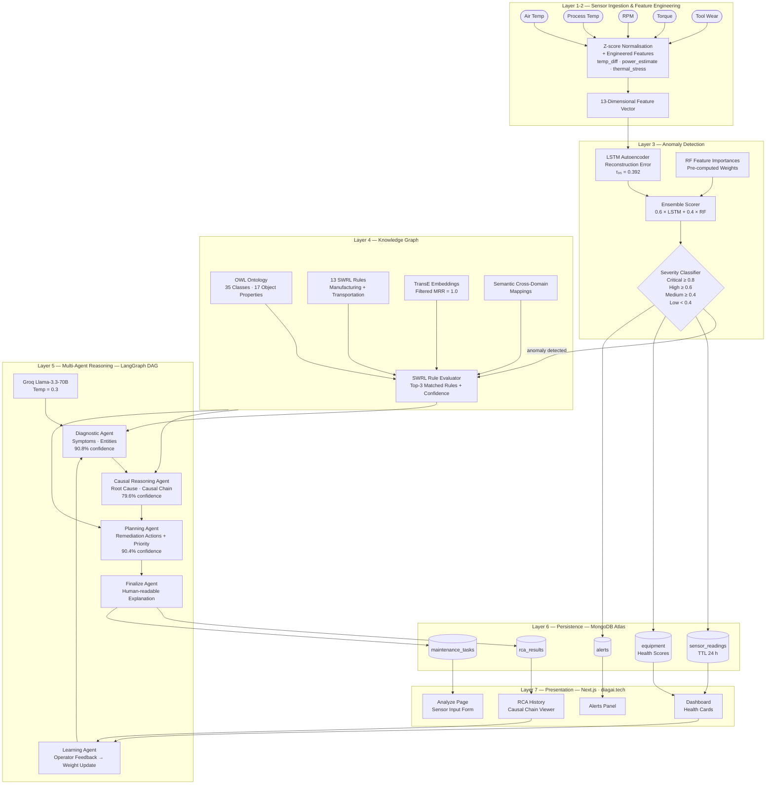

```mermaid
graph TB
    subgraph SL["Layer 1-2 — Sensor Ingestion & Feature Engineering"]
        direction LR
        S1([Air Temp]) & S2([Process Temp]) & S3([RPM]) & S4([Torque]) & S5([Tool Wear])
        --> FE["Z-score Normalisation\n+ Engineered Features\ntemp_diff · power_estimate · thermal_stress"]
        --> FV["13-Dimensional Feature Vector"]
    end

    subgraph DET["Layer 3 — Anomaly Detection"]
        direction LR
        LSTM["LSTM Autoencoder\nReconstruction Error\nτ₉₅ = 0.392"]
        RF["RF Feature Importances\nPre-computed Weights"]
        ENS["Ensemble Scorer\n0.6 × LSTM + 0.4 × RF"]
        SEV{"Severity Classifier\nCritical ≥ 0.8\nHigh ≥ 0.6\nMedium ≥ 0.4\nLow < 0.4"}
        LSTM --> ENS
        RF --> ENS
        ENS --> SEV
    end

    subgraph KG["Layer 4 — Knowledge Graph"]
        direction LR
        OWL["OWL Ontology\n35 Classes · 17 Object Properties"]
        SWRL["13 SWRL Rules\nManufacturing + Transportation"]
        EMBT["TransE Embeddings\nFiltered MRR = 1.0"]
        MAP["Semantic Cross-Domain\nMappings"]
        EVAL["SWRL Rule Evaluator\nTop-3 Matched Rules + Confidence"]
        OWL & SWRL & EMBT & MAP --> EVAL
    end

    subgraph AGENTS["Layer 5 — Multi-Agent Reasoning — LangGraph DAG"]
        direction LR
        LLM["Groq Llama-3.3-70B\nTemp = 0.3"]
        AG1["Diagnostic Agent\nSymptoms · Entities\n90.8% confidence"]
        AG2["Causal Reasoning Agent\nRoot Cause · Causal Chain\n79.6% confidence"]
        AG3["Planning Agent\nRemediation Actions + Priority\n90.4% confidence"]
        AG4["Finalize Agent\nHuman-readable Explanation"]
        LA["Learning Agent\nOperator Feedback → Weight Update"]
        LLM --> AG1 --> AG2 --> AG3 --> AG4
    end

    subgraph STORE["Layer 6 — Persistence — MongoDB Atlas"]
        direction LR
        COL1[("sensor_readings\nTTL 24 h")]
        COL2[("equipment\nHealth Scores")]
        COL3[("alerts")]
        COL4[("rca_results")]
        COL5[("maintenance_tasks")]
    end

    subgraph UI["Layer 7 — Presentation — Next.js · diagai.tech"]
        direction LR
        DASH["Dashboard\nHealth Cards"]
        ALERT["Alerts Panel"]
        HIST["RCA History\nCausal Chain Viewer"]
        ANA["Analyze Page\nSensor Input Form"]
    end

    FV --> LSTM
    SEV -- "anomaly detected" --> EVAL
    EVAL --> AG1
    KG --> AG2 & AG3
    SEV --> COL1 & COL2 & COL3
    AG4 --> COL4 & COL5
    COL1 & COL2 --> DASH
    COL3 --> ALERT
    COL4 --> HIST
    COL5 --> ANA
    DASH --> LA
    HIST --> LA
    LA --> AG1

```
